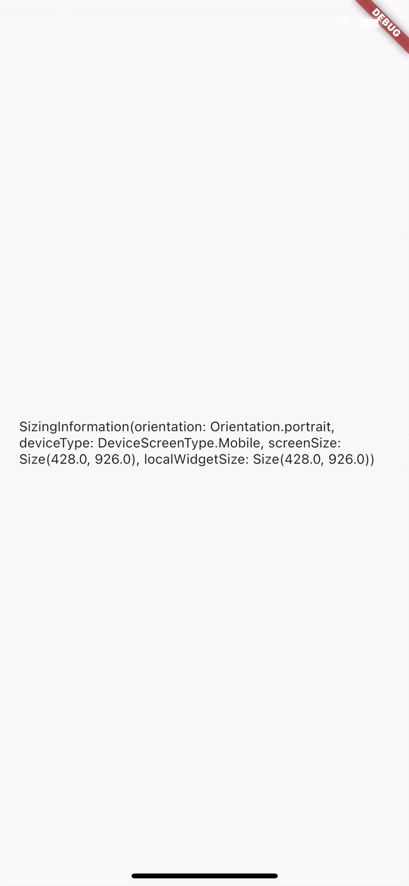

# responsive_screen_builder

Responsive Screen Builder provides you with the base builder widget with all the information that are required to build responsive screens.

## Installing

Add the following to your `pubspec.yaml` file:

    dependencies:
      responsive_screen_builder:

## Features
- Provides you with screen orientation
- Give information about possible screen type (Mobile, Tablet and Desktop)
- Provides with the total size of the current screen the app is being displayed on
- Gives the bounds that the current widget is being drawn in


## Usage
```dart
import 'package:responsive_screen_builder/responsive_screen_builder.dart';
```
```dart
ResponsiveScreenBuilder(builder: (context, screenInformation) {
      // screenInformation.deviceType;
      // screenInformation.screenSize;
      // screenInformation.localWidgetSize;
      // screenInformation.orientation;
      return Scaffold(
        body: Padding(
          padding: const EdgeInsets.all(20.0),
          child: Center(
            child: Text(screenInformation.toString()),
          ),
        ),
      );
    })
```


## Screenshot

